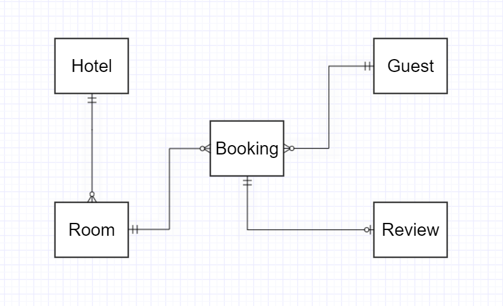
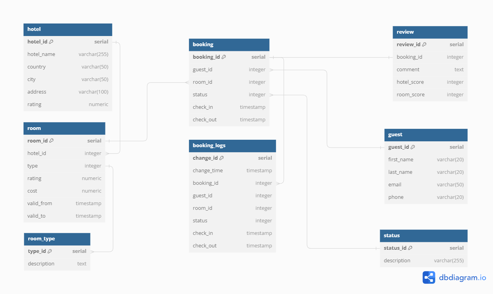

#  Моделирование базы данных для системы бронирования отелей

В данном проекте я моделирую базу данных для сервиса бронирования отелей.

**Общие сведения:**
    
 1) В hotel хранится информация об отеле (название, адрес, рейтинг).

 2) В room хранится информация о посуточной цене за номер, о его классе (одноместный, люкс и т.д.) и о том, в каком отеле он находится. 

 3) В booking хранится основная информация о бронировании и в частности текущее состояние бронирования (оформлено, перенос, отменено и т.д.).
    
 4) В guest - имя, фамилия, электронная почта и телефон пользователя.
    
 5) В review находятся отзывы пользователей на их комнату и отель в целом, на основании которых вычисляются оценки.

**2 таблицы являются версионными:**

 1) Booking версионируется в SCD4 (изменения хранятся в booking changes). Выбрал это формат, так как мы хотим иметь быстрый доступ к актуальной информации о бронировании, однако нам так же важны предыдущие состояния бронирования для анализа и сохранения контекста.

 2) Room версионируется в SCD2, т.к. нам важно знать историю изменения цен, но изменения будут не очень частыми и скорее сезонными, а потому это оптимальный формат.

БД находится в 3НФ.

Типы комнат и статусы бронирований вынесены в отдельные таблицы для удобства масштабирования.

## Концептуальная модель
  

## Логическая модель
  

## Физическая модель
